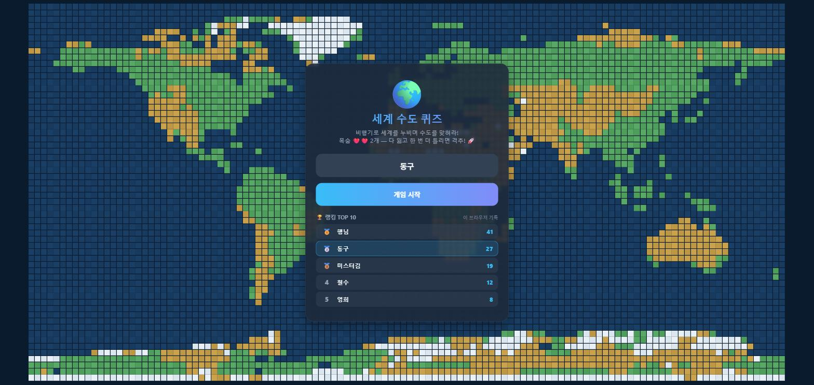
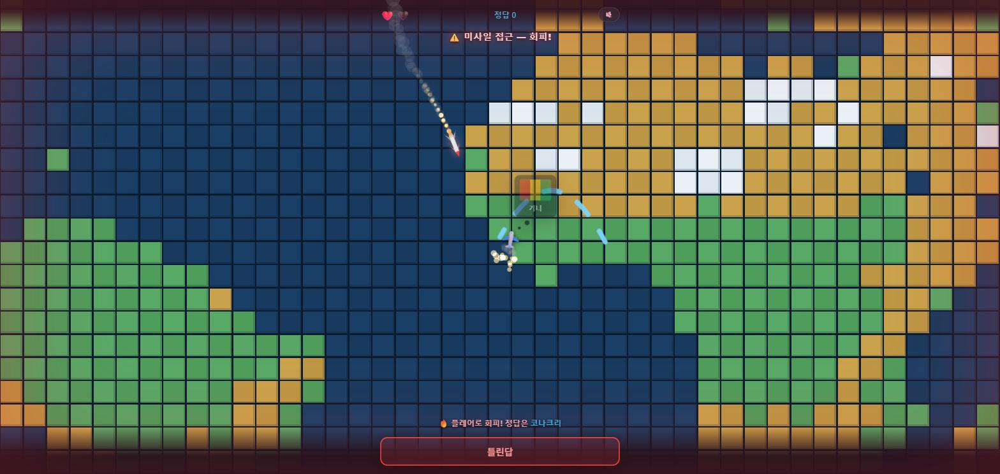

# 🌍 CAP AIRLINE

비행기를 타고 세계를 누비며 각국의 수도를 맞히는 웹 게임.
**HTML 파일 하나**가 게임의 전부다. 설치도, 빌드도, 서버도 필요 없다.

> ▶ **[지금 플레이하기](https://capairline.com/)**



## 이런 게임이다

블럭으로 그린 세계지도 위를 비행기가 날아간다. 도착한 나라의 국기가 말풍선으로 뜨면
하단 입력창에 **수도를 타이핑하고 Enter**. 맞히면 폭죽과 함께 곧바로 다음 나라로 출발한다.

틀리면? **공해상에서 미사일이 날아온다.**



미사일은 목표를 향해 유도(호밍) 곡선을 그리며 접근하고, 비행기는 지그재그로 회피 기동을 한다.
근접하면 **플레어(적외선 기만탄)를 사출해 미사일을 속여 넘긴다** — 아슬아슬하게 빗나간 미사일은
엉뚱한 곳에서 터진다. 목숨은 하나 깎이지만 비행기는 살아남는다.

단, 목숨을 다 잃은 뒤 한 번 더 틀리면 **플레어가 남아있지 않다.**
록온이 풀리지 않은 미사일이 그대로 파고든다. 그땐 격추다.

## 규칙

- **제한시간 7초.** 도착하는 순간 카운트다운이 시작된다. 검색할 시간은 없다
- 답은 **도착한 뒤에만** 받는다. 비행 중이나 미사일이 날아오는 동안 친 Enter는 무시된다
- **목숨 ❤️❤️ 2개.** 다 잃고 **한 번 더** 틀리면 게임오버 (총 3번의 오답까지 버틴다)
- 나라는 **중복 없이** 출제된다. 100개국을 한 바퀴 다 돌기 전엔 같은 나라가 다시 나오지 않는다
- 초반엔 인구가 많은 익숙한 나라가, 뒤로 갈수록 생소한 나라가 나온다 (난이도 상승)
- 100번째 나라까지 맞히면 **🌍 세계일주 완주!** 연출이 터지고, 새 한 바퀴가 이어진다
- 점수 = 맞힌 개수. 게임이 끝나면 **이름별 최고 점수 랭킹**에 등록된다

## 특징

- **100개국** — UN 회원국 193개국 중 **인구 상위 100개국** (UN 세계인구전망 추계 기준)
- **오프라인 내장 블럭 세계지도** — 실제 지도를 120×60 격자로 다운샘플링. 대륙 모양이 살아있다
- **카메라 연출** — 비행 경로를 따라 줌인 → 순항 중 줌아웃 → 도착지 줌인
- **미사일 회피 시퀀스** — 선회율 제한 호밍, 플레어 기만, 록온 조준선, 충격파 폭발, 스크린 셰이크
- **사운드** — 음원 파일 없이 WebAudio로 실시간 합성 (발사음, 거리에 따라 빨라지는 경고음, 폭발, 팡파르). 🔊 버튼으로 음소거
- **온라인 랭킹** — 전 세계가 공유하는 이름별 최고 점수 TOP 10. 서버 장애 시엔 로컬 기록으로 폴백해서 게임은 안 멈춘다

> 💻 넓은 화면에서 가장 잘 보이지만, 모바일도 대응돼 있다 (키보드가 올라와도 입력창이 안 가린다).

## 실행 방법

`index.html`을 브라우저에서 열면 끝이다.

```bash
# 그냥 더블클릭하거나
start index.html

# 로컬 서버로 띄우고 싶다면
python -m http.server 5599
# → http://127.0.0.1:5599/index.html
```

빌드 단계가 없다. 코드를 고치고 새로고침하면 그게 배포다.

## 배포

**[capairline.com](https://capairline.com/)** 에서 서비스 중이다. (GitHub Pages + 커스텀 도메인, HTTPS)
Settings → Pages에서 `main` / `(root)`를 고르는 것 외엔 설정이 없고, **`main`에 푸시하면 자동 재배포**된다.

정적 파일뿐이라 Netlify·Cloudflare Pages·아무 웹서버에 올려도 똑같이 돌아간다.

## 온라인 랭킹 (포크한 경우)

이 저장소는 이미 작성자의 Supabase 프로젝트에 연결돼 있다.
**포크해서 쓴다면** 자기 [Supabase](https://supabase.com) 무료 프로젝트를 만들고
`index.html` 상단의 두 줄을 바꿔야 한다. (빈 문자열로 두면 브라우저 로컬 랭킹으로 동작한다.)

```js
const RANK = {
  url: "https://xxxxxxxx.supabase.co",           // Project URL
  key: "sb_publishable_xxxxxxxxxxxxxxxxxxxx",    // Publishable key
};
```

테이블 생성 SQL과 보안 설계(왜 upsert가 아니라 insert-only인지)는 [CLAUDE.md](CLAUDE.md)의
"온라인 랭킹 셋업" 항목에 정리돼 있다.

> Publishable 키는 클라이언트에 노출되는 것이 정상이며 RLS와 테이블 권한으로 제한된다.
> **`sb_secret_...` (구 `service_role`) 키는 절대 넣지 말 것.**

## 기술 스택

| | |
|---|---|
| 언어 | HTML5 + CSS + 바닐라 JavaScript (프레임워크·라이브러리 **없음**) |
| 렌더링 | 지도·이펙트는 `<canvas>`, 국기 핀·비행기는 DOM, 카메라는 CSS `transform` |
| 사운드 | WebAudio 실시간 합성 (오실레이터 + 노이즈 버퍼) |
| 랭킹 | Supabase REST — 테이블 권한 + RLS로 등록·조회만 허용 (연결 실패 시 `localStorage` 폴백) |
| 외부 의존성 | 국기 이미지([flagcdn.com](https://flagcdn.com))뿐. 지도·사운드·이펙트는 전부 자체 포함 |

## 프로젝트 구조

```
index.html    게임 전체 (HTML + CSS + JS 인라인)
CLAUDE.md     아키텍처 문서 — 코드를 고치기 전에 읽을 것
README.md     이 문서
LICENSE       MIT
CNAME         커스텀 도메인 (GitHub Pages 자동 생성)
docs/         스크린샷
```

## 크레딧

- 국기 이미지 — [flagcdn.com](https://flagcdn.com)
- 인구 데이터 — UN 세계인구전망(World Population Prospects)

## 라이선스

[MIT License](LICENSE) © 2026 TIONBARY

자유롭게 쓰고 고치고 퍼뜨려도 된다. 저작권 표시만 남겨주면 된다.
단, 국기 이미지는 이 저장소의 것이 아니라 [flagcdn.com](https://flagcdn.com)에서 불러오는 것이다.
